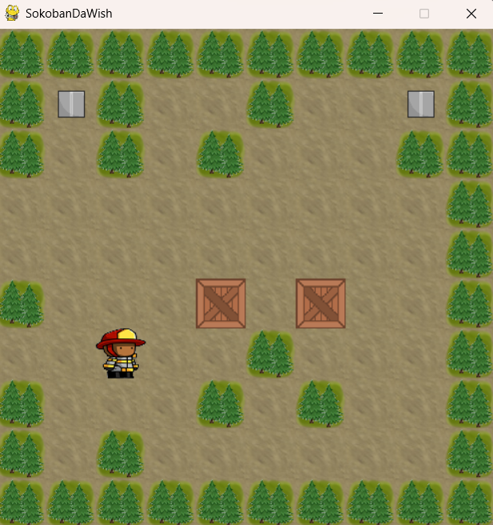

# Sokoban Puzzle Game

A Python implementation of the classic turn-based Sokoban puzzle game, built with Pygame. Developed as an academic project for the Object-Oriented Programming (POO) course at Iscte.



## About

The objective is to guide the player to push all boxes onto designated target spots across consecutive levels. The project emphasizes clean Object-Oriented Design patterns, custom Python decorators for movement validation, robust file parsing, and domain-specific exception handling.

## Key Features

- **Turn-based Grid Movement:** Intuitive controls using Arrow Keys or WASD.
- **Robust Level Parser:** Automatically reads and validates 10x10 grid text files, handling edge cases such as extra characters, missing spots, and malformed layouts.
- **Custom Decorator Pipelines:** `@collision_obstacles` and `@collision_boxes` decorators isolate boundary checks and multi-box collision logic from core movement methods.
- **Performance Metrics:** Real-time tracking of active steps and elapsed completion time per level.
- **Multi-Level Progression:** Seamless transition across sequential levels.

## Level Configuration Format

Levels are stored in the `collections/` directory as 10x10 text grids using the following encoding:

| Symbol | Description |
| :---: | :--- |
| `p` | Player start position |
| `b` | Pushable box |
| `s` | Target box spot |
| `o` | Immovable obstacle (Pine tree) |
| `_` | Empty walkable space |

## Controls

- **Move Up:** `W` or `Up Arrow`
- **Move Down:** `S` or `Down Arrow`
- **Move Left:** `A` or `Left Arrow`
- **Move Right:** `D` or `Right Arrow`
- **Restart Level:** `R`

## Project Structure

```text
├── classes/
│   ├── Box.py
│   ├── BoxSpot.py
│   ├── GameObject.py
│   ├── ImageCollection.py
│   ├── Level.py
│   ├── LevelFactory.py
│   ├── MovableObject.py
│   ├── Obstacle.py
│   ├── PineTree.py
│   ├── Player.py
│   └── StepableObject.py
├── collections/          # Level text files (level1.txt, level2.txt, ...)
├── gameengine/
│   └── GameEngine.py     # Game loop and event handling
├── images/               # Visual assets and sprites
├── decorators.py         # Collision and boundary validation decorators
├── exceptions.py         # Domain-specific error definitions
├── main.py               # Application entry point
├── requirements.txt      # Project dependencies
└── README.md